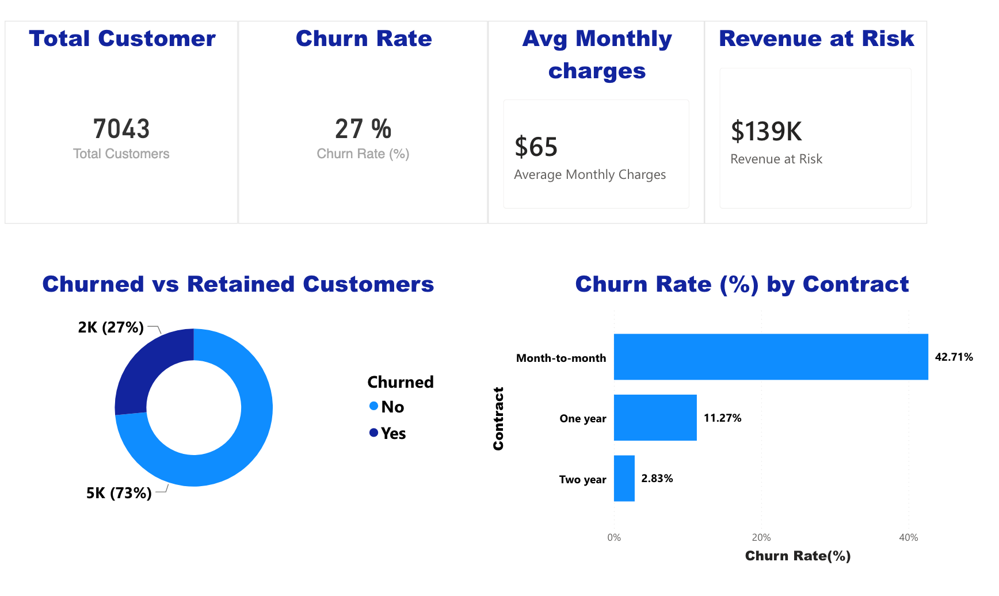
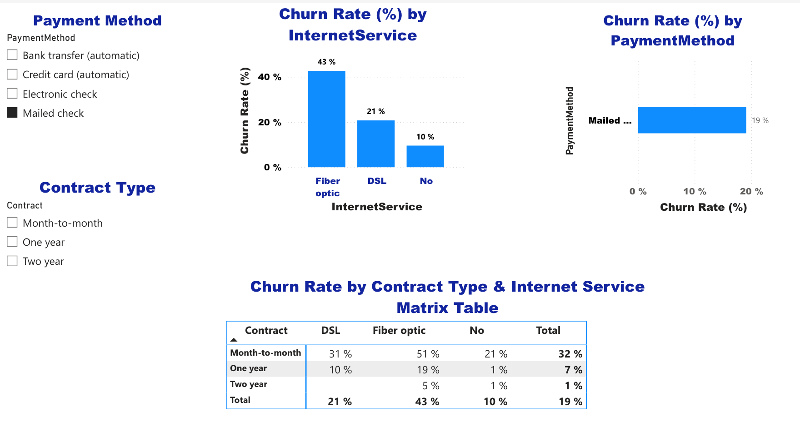

# Telecom Customer Churn - Power BI Decision-Making Dashboard

An interactive **Power BI** dashboard and decision-making business case that analyses telecom customer churn, identifies the segments most at risk, and quantifies the revenue at stake — turning 7,000+ customer records into clear, actionable retention recommendations.

> Academic group project — *Decision-Making Analytics* (2026).
> **Tech:** `Power BI` · `Excel` · `OLAP` · `data preparation` · `dimensional modelling`

---

## Overview

Customer churn is one of the most important profitability metrics for telecom providers, where acquiring a new customer costs far more than retaining one. This project uses **descriptive and diagnostic analytics** (OLAP-style slice / dice / drill-down / roll-up in Power BI) to answer a core managerial question: **which customers are most likely to churn, and where should retention effort and budget go for the greatest impact?**

**Dataset:** [Telco Customer Churn](https://www.kaggle.com/datasets/blastchar/telco-customer-churn) (Kaggle, public) — 7,043 customers with demographics, contract, service and billing attributes.

## My contribution

A five-person group project. **I built the core analytical components:**

- **The 3-page Power BI dashboard** — executive overview, churn segmentation, and detail views, with KPIs, slicers and cross-filtering for interactive OLAP exploration.
- **Data preparation & transformation** — type fixes (e.g. `TotalCharges`), handling missing/invalid records, tenure binning, and calculated measures (churn rate, average monthly charges, estimated revenue at risk, tenure band).
- **The analytical approach and decision model** — the descriptive/diagnostic technique design, the OLAP dimensional framing (facts vs dimensions), and linking the analysis back to the business questions.

Teammates contributed the business context, OLAP technology evaluation, and recommendations sections.

## Dashboard preview

<!-- Add screenshots of each dashboard page to /docs and update paths -->



> *Built on the public Telco Customer Churn dataset — no proprietary or personal data.*

---

## Key findings

- **27% of 7,043 customers churned**, with an estimated **~$139k/month of revenue at risk**.
- **Contract type is the strongest driver:** month-to-month customers churn at **42.7%**, vs **11.3%** (one-year) and **2.8%** (two-year).
- **Churners pay more on average** ($74.44 vs $61.31 monthly) — high-value customers are disproportionately at risk.
- **Fiber-optic** customers and those paying by **electronic cheque** churn at notably higher rates.
- **Tenure has a clear inverse relationship** with churn — risk is concentrated early in the customer lifecycle.

## Business recommendations

- Incentivise month-to-month customers onto **longer contracts** (discounts, bundles, loyalty rewards).
- Encourage **automated payment methods** over electronic cheque to reduce friction-driven churn.
- Prioritise **early-lifecycle** engagement and review **pricing/value** for high-charge segments.

---

## Repository structure

```
.
├── docs/                         Dashboard screenshots (one per page)
├── Telco_Churn_Dashboard.pbix    Power BI report file
├── Churn_Business_Case_Summary.pdf  Short project summary (analysis + recommendations)
└── README.md
```

> The Kaggle dataset is **not** redistributed here — download it from the link above.

## Analytical concepts demonstrated

OLAP operations (slicing, dicing, drill-down, roll-up) · star-schema thinking (facts: churn, charges, revenue-at-risk; dimensions: contract, tenure, payment method, internet service) · KPI design · segmentation · data-driven decision support.

---

## Author

**Kay Jiang** · [kay0223@gmail.com](mailto:kay0223@gmail.com) · [LinkedIn](https://www.linkedin.com/in/kay-jiang-10306480/)
Master of Data Science (AI), Sydney Polytechnic Institute.
